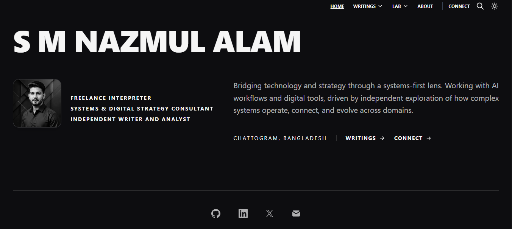

# S M Nazmul Alam | The Face & The Forge

This repository contains the source code for [smnazmul.com](https://smnazmul.com), a dual-architecture digital identity built to bridge technology, strategy, and systems-level engineering. 

The site is divided into two distinct engines: **The Face** (analytical writings and strategic frameworks) and **The Forge** (raw technical documentation and system deployments).

## 🏗️ Architecture & Stack

- **Framework:** [Astro](https://astro.build/) (Static Site Generation)
- **Styling:** [Tailwind CSS](https://tailwindcss.com/) (Custom UI/UX overlays)
- **Search Engine:** [Pagefind](https://pagefind.app/) (Static indexing with custom JS event delegation and hardened hit-boxes)
- **Content:** Markdown / MDX 
- **Typography & Theme:** Dual Light/Dark modes with persistent toggle and architectural spacing.

## 👁️ Visual Overview

<div style="display: flex; gap: 1rem; margin-top: 1rem;">
    
    
</div>

## 🖋️ The Face (Writings & Analysis)

The strategic core of the site. This section explores how complex systems operate, connect, and evolve across domains. 

- **Power & Statecraft:** Geopolitics, governance, and policy analysis.
- **Civilization:** Anthropological studies and historical frameworks.
- **Systems & Infrastructure:** Corporate strategy, business analysis, and structural development.
- **Technology & Cyber:** Cybernetics, digital strategy, and the intersection of tech and society.

## 🔬 The Forge (Lab Domains)

The technical core of the site. This section documents functional, real-world deployments, reverse engineering, and low-level system modifications.

- **AI:** Local LLM and generative AI deployments (e.g., Stable Diffusion WebUI Forge on Snapdragon environments).
- **Android:** Deep-level OS modification, custom ROM environments, and root-level implementations (Magisk/Zygisk).
- **Systems Engineering:** Network architecture, performance optimization, and local hosting.
- **Reverse Engineering:** APK analysis, security hardening, and structural debloating strategies.

## 🔗 Connections

- **[GitHub](https://github.com/smnashuvo)**
- **[LinkedIn](https://www.linkedin.com/in/smnashuvo/)**
- **[X (Twitter)](https://x.com/smnashuvo)**
        
## ⚙️ Local Development

To run this environment locally:

```sh
# Install dependencies
npm install

# Start the dev server (localhost:4321)
npm run dev

# Build the production output
npm run build

# Generate the static search index (Required after build)
npx pagefind --site dist