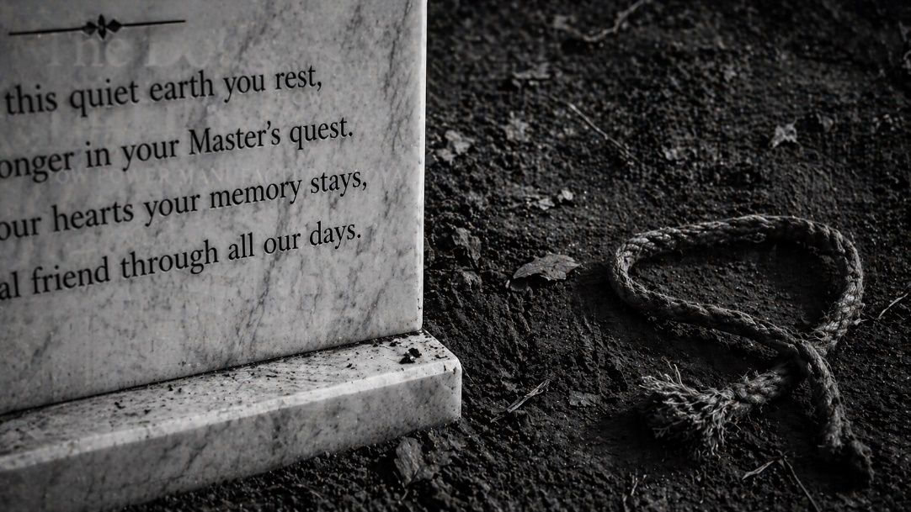

There is a story from the Raj Bhavan in Kolkata that most people have never heard. Not about governance, or politics, or the independence of India. About a dog named Marco, and what happened to him — and to another dog — inside the same compound, within the same decade.

The details are small. That is precisely why they matter.

---

Padmaja Naidu was not an ordinary woman. Daughter of the poet and activist Sarojini Naidu, she moved through India's independence movement with the kind of quiet authority that doesn't announce itself. She was also, for years, the companion of Jawaharlal Nehru — India's first Prime Minister, the architect of a modern nation, a man whose name still commands reverence across the subcontinent.

By most accounts, Padmaja believed Nehru would marry her after the death of his wife Kamala. He did not. The years passed. Her marriageable years, as the phrase goes, "ended" — a phrase that carries its own quiet violence, the weight of a life redirected around someone else's choices. She never had a husband. She never had children.

What she had instead was a governorship — West Bengal, 1956 — and a collection of animals she loved with the kind of devotion that people often redirect when human love fails to return.

Among them was Marco, an Alsatian. Her favourite.

---

When Marco died at Raj Bhavan, the response was remarkable.

Carpet was cut into pieces. Fresh cotton was laid out. Marco was placed on a bier — a proper bier, carried on shoulders — and taken to a shaded corner by a small pond in the southwest of the compound. There, before Padmaja herself, with tears she barely contained, he was buried. A white marble gravestone was placed over the ground. On it, a poem — her own, carved in stone.

Kolkata's prominent citizens rushed to offer condolences. The telephone at Raj Bhavan rang continuously. At the order of the Secretary, staff were given a half-day off in mourning.

A half-day off. For a dog.

Not a detail to mock. A detail to study.

---

In June 1961, Padmaja left for England — a two-month trip. While she was away, another of her dogs died.

No bier this time. No cotton, no carpet, no marble. The body was tied by its tail and dragged across the compound grounds to be buried beside Marco.

No one mourned. No one wept. No phone calls came. No half-day was declared.

Same compound. Same kind of animal. Same category of loss.

---

Different result entirely.

Power doesn't simply attract loyalty. It manufactures it — and manufactures it so thoroughly that the people performing it often can't locate where the performance ends and the feeling begins.

The second dog is where the mechanism shows itself. The staff at Raj Bhavan were not unusually cynical people. Their grief for Marco wasn't entirely fabricated. But grief, like most social behavior, is calibrated — often without conscious decision — to whoever is in the room. When Padmaja was present, Marco's death was a tragedy requiring ceremony. When she was absent, the next dog was an inconvenience requiring disposal.

The marble gravestone remained. The poem remained. Stone, unlike people, holds its position regardless of audience. The people adjusted. That is the point.

---

What power does, specifically, is corrupt the feedback between action and intent. The closer you are to someone powerful — or the more visible your association with them — the less accurately the behavior you receive reflects who those people actually are.

Consider what Padmaja received, throughout the years of her closeness to Nehru and then to the Governor's office: deference, attention, warmth, the full range of signals that ordinarily tell us whether someone genuinely cares. None of those signals were necessarily dishonest in isolation. But all of them were shaped, at least partially, by her position. Her position made her goodwill worth pursuing. Her goodwill made warmth toward her a practical investment. The investment looked, from the inside, indistinguishable from affection.

This is the specific distortion power creates. It doesn't produce enemies or obvious flatterers — those are easy to read. It produces a middle category far harder to navigate: people who are genuinely warm toward you, and also warm toward you for reasons that would not survive a change in your circumstances. You cannot separate these two things in real time. Neither can they.

The staff carrying Marco on a bier were not lying. They were responding to the presence of someone whose goodwill shaped their daily lives — the kinds of assignments they received, the atmosphere they worked in, the small favours that make institutional life bearable. That is not cynicism. It is social intelligence operating normally, producing behavior that, from the outside, looks identical to genuine care. The problem is epistemic, not moral: Padmaja cannot easily know, while it is happening, which parts of their attention are real, and which are contingent on her watching.

The powerful person, then, is someone who receives more social signal than almost anyone around her — and finds that less of it is legible.

---

Nehru was not a villain in Padmaja's life. He was something more ordinary: a man whose commitments left insufficient room for the person nearest to him. The cause was always larger. The vision always longer. Padmaja was brilliant, politically connected, deeply human, and — in his accounting — a secondary variable. He had the power. She had the attachment. The attachment bore the full weight of that asymmetry, because that is what attachments do when the other side doesn't match them.

She spent years at the edge of his world, close enough to feel its warmth, not close enough to be protected by it. The governorship extended that pattern into new architecture. She remained, structurally, a person whose value to others was adjacent to power rather than independent of it. Which means the loyalty she received was always, in some proportion, loyalty to the position — and she had no clean way to know what proportion that was.

---

The question the two funerals leave open is not whether the people around us are loyal. Most people, most of the time, perform something that functions well enough as loyalty that the distinction barely matters — until the moment it does, and by then the conditions for testing it have already arrived.

The real question is what circumstances would let you see the difference.

Padmaja's life — not her philosophy, her life — suggests one answer: genuine care shows itself in absence and powerlessness, not in the rooms where people rush to offer condolences. What you find out, when you are no longer present and no longer useful, is who treats the next thing in your absence the way they treated the first thing in your presence.

She had a Governor's office, institutional influence, the full apparatus of proximity to power. The most accurate reading of who actually cared about her came from an unattended death, witnessed by no one she would ever meet, in a compound she had temporarily left.

That is a hard thing to sit with. She was not naive — a woman of her background and experience rarely is. She likely understood, in some register, that the warmth around her was not all of the same kind. What she could not do, what none of us can do from inside that position, is see it clearly while it is happening.

---

The marble gravestone is still there, reportedly, in a corner of the Raj Bhavan grounds. A poem carved by a woman who spent her life close to enormous power — shaped by it, sustained by parts of it, never fully able to see through it.

Marco got a monument because she was watching.

The other dog got dragged because she was not.

That gap — between those two funerals — is where most of what we call loyalty actually lives.
